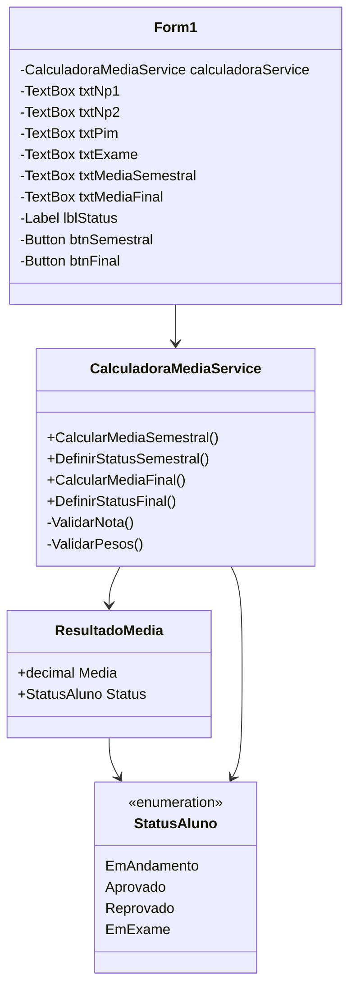

# Diagrama UML

## Diagrama de Classes

## Explicação

O projeto é dividido em três camadas principais:

- `CalculadoraMedias.Core`
  - Contém as regras de negócio.
  - Calcula média semestral, média final e status do aluno.

- `CalculadoraMedias.Desktop`
  - Contém a interface gráfica em Windows Forms.
  - Utiliza a biblioteca Core para realizar os cálculos.

- `CalculadoraMedias.Tests`
  - Contém os testes unitários com xUnit.

## Classes Principais

### StatusAluno

Enum que representa os possíveis status:

- EmAndamento
- Aprovado
- Reprovado
- EmExame

### ResultadoMedia

Classe usada para retornar:

- Média calculada
- Status do aluno

### CalculadoraMediaService

Classe responsável por:

- Calcular média semestral.
- Calcular média final.
- Validar notas.
- Definir status do aluno.

### Form1

Tela principal da aplicação.

Responsável por:

- Receber as notas.
- Exibir os resultados.
- Controlar os botões da interface.# Diagrama UML

## Diagrama de Classes

## Explicação

O projeto é dividido em três camadas principais:

- `CalculadoraMedias.Core`
  - Contém as regras de negócio.
  - Calcula média semestral, média final e status do aluno.

- `CalculadoraMedias.Desktop`
  - Contém a interface gráfica em Windows Forms.
  - Utiliza a biblioteca Core para realizar os cálculos.

- `CalculadoraMedias.Tests`
  - Contém os testes unitários com xUnit.

## Classes Principais

### StatusAluno

Enum que representa os possíveis status:

- EmAndamento
- Aprovado
- Reprovado
- EmExame

### ResultadoMedia

Classe usada para retornar:

- Média calculada
- Status do aluno

### CalculadoraMediaService

Classe responsável por:

- Calcular média semestral.
- Calcular média final.
- Validar notas.
- Definir status do aluno.

### Form1

Tela principal da aplicação.

Responsável por:

- Receber as notas.
- Exibir os resultados.
- Controlar os botões da interface.